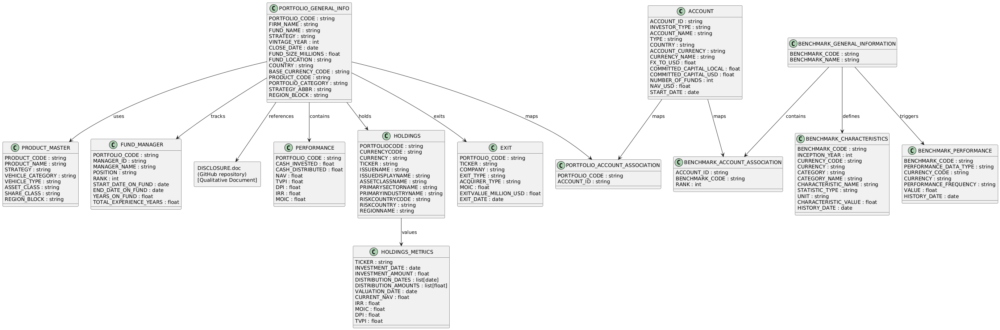

# VC_Capstone_Project

This project simulates a synthetic venture capital (VC) investment ecosystem from the perspective of institutional Limited Partners (LPs). It is aligned with Assette’s Snowflake schema and supports automated fact sheet generation, benchmarking, and performance reporting.

The dataset includes portfolios, investor accounts, fund-manager relationships, holdings, exits, product classifications, and performance metrics. Data is generated using modular Python scripts, enriched with metadata from real-world APIs (country, currency, and sector), and exported as structured CSV/JSON files.

All final outputs are Snowflake-ready and designed to mirror institutional data pipelines.

---

## UML Class Diagram

The following UML diagram visualizes the structure and relationships among core tables such as PORTFOLIO_GENERAL_INFO, ACCOUNT, PERFORMANCE, HOLDINGS, BENCHMARK and PRODUCT_MASTER.



---

<pre> ## Project Structure ``` VC_Capstone_Project/ ├── README.md # Quick-start guide ├── UML.png ├── APIs/ # API-based data enrichment │ ├── countries_api.py │ ├── extract_currency_api.py │ ├── manager_json.py │ └── sectors.py ├── benchmarks/ # Benchmark fund & performance modules │ ├── benchmarck_characteristics.py │ ├── benchmark_account_association.py │ ├── benchmark_general_information.py │ └── benchmark_performance.py ├── holdings/ # Holdings and exit logic │ ├── exit.py │ ├── holdings.py │ └── holdings_metrics.py ├── portfolio/ # Core portfolio entity generation │ ├── account.py │ ├── fund_manager.py │ ├── portfolio_account_association.py │ ├── portfolio_general_info.py ├── product/ # Product & performance logic │ ├── performance.py │ └── product_master.py ├── JSON/ # Cached API responses │ ├── currency_lookup.json │ ├── gics.json │ ├── manager_data.json │ ├── sectors.json │ └── synthetic_countries.json ├── CSVs/ # Final export tables (for Snowflake) │ ├── accounts.csv │ ├── df_benchmark_account_association.csv │ ├── df_benchmark_characteristics.csv │ ├── df_benchmark_general.csv │ ├── df_benchmark_performance.csv │ ├── fund_managers.csv │ ├── holdings.csv │ ├── holdings_metrics.csv │ ├── portfolio_account_map.csv │ ├── portfolio_general_info.csv │ └── product_master.csv ``` </pre>
---

## Getting Started

1. Install dependencies:
```bash
pip install -r requirements.txt
```

2. Run core modules in order:
- APIs (to generate JSON)
- portfolio/
  1. portfolio_general_info.py
  2. account.py
- product/
  1. product_master.py
  2. performance.py
- holdings/
  1. holdings.py
  2. holdings_metrics.py
  3. exit.py
- benchmarks/
  1. benchmark_general_information.py
  2. benchmarck_characteristics.py
  3. benchmark_performance.py
  4. benchmark_account_association.py
- Export to CSVs

3. Upload CSV outputs to Snowflake.

---

## Notes
-  Modules not marked with numbers can be run anytime after their dependent data is created.
